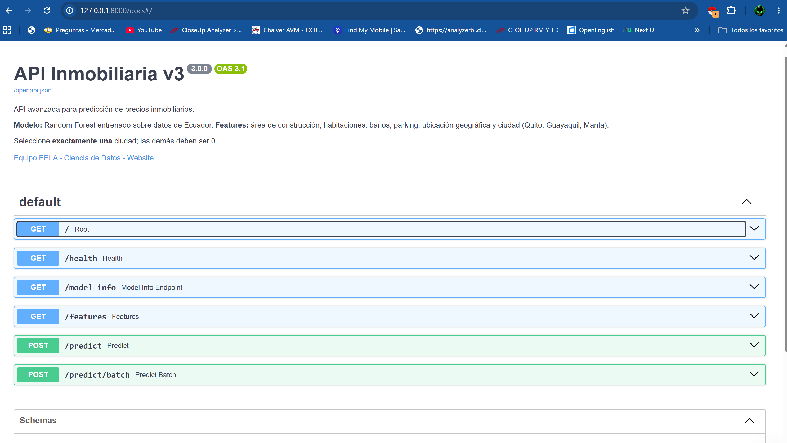
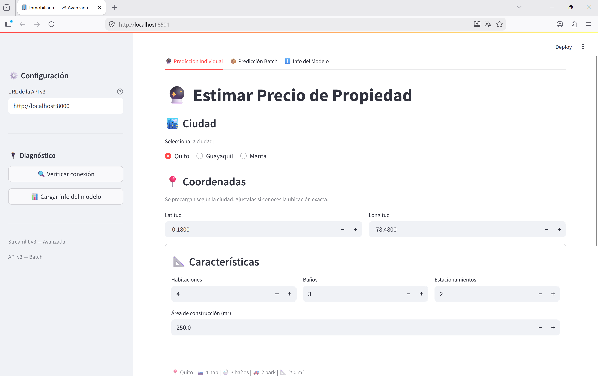
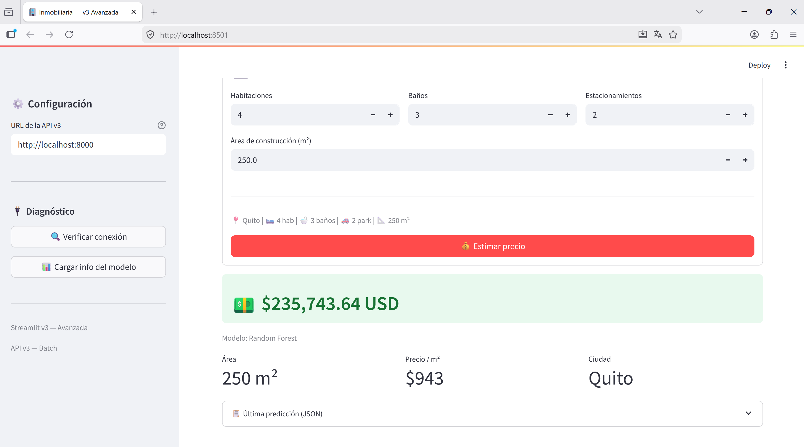

# 🏠 Sistema Inteligente de Predicción de Precios de Viviendas

## Proyecto Final – Diplomado Python Full Stack

### 👨‍💻 Autor

**Ivan Montalvo**

---

# 📌 Descripción

Este proyecto desarrolla una aplicación web para estimar el precio de viviendas en Ecuador mediante técnicas de Machine Learning.

La solución integra una API REST desarrollada con **FastAPI** y una interfaz web desarrollada con **Streamlit**.

El modelo de predicción fue entrenado utilizando el algoritmo **Random Forest Regressor**, permitiendo estimar el precio de una vivienda en tiempo real a partir de sus características principales.

---

# 🎯 Objetivo

Desarrollar una aplicación web que permita estimar el precio de viviendas mediante técnicas de Machine Learning utilizando Python.

## Objetivos Específicos

- Preparar los datos inmobiliarios para entrenamiento.
- Construir un modelo predictivo utilizando Random Forest.
- Publicar el modelo mediante FastAPI.
- Desarrollar una interfaz amigable utilizando Streamlit.
- Integrar ambos componentes mediante solicitudes HTTP.

- Web Scraping
- Procesamiento de datos
- Machine Learning
- FastAPI
- Streamlit
- Predicción de precios en tiempo real

cumpliendo con los requerimientos del Proyecto Final del Diplomado Python Full Stack.

---

# 🏗 Arquitectura del Proyecto

El proyecto implementa una arquitectura cliente-servidor para realizar predicciones de precios de viviendas en tiempo real.

```text
                 Usuario
                     │
                     ▼
        Aplicación Web (Streamlit)
                     │
              Solicitud HTTP (POST)
                     │
                     ▼
              API REST (FastAPI)
                     │
          Validación de los datos
                     │
                     ▼
     Modelo Random Forest (.pkl)
                     │
              Predicción del precio
                     │
                     ▼
      Respuesta JSON hacia Streamlit
                     │
                     ▼
     Precio estimado mostrado al usuario
```

Esta arquitectura permite separar la interfaz gráfica del modelo de Machine Learning, facilitando el mantenimiento, la escalabilidad y la reutilización de la API.

---

# 📂 Estructura del Proyecto

```text
proyecto_final_prediccion_casas/

│
├── api_v3_avanzada.py
├── streamlit_v3_avanzada.py
├── modelo_inmobiliario.pkl
├── plusvalia_procesado.csv
├── plantilla_batch.csv
├── test_100_propiedades.csv
├── ejercicio_eela.py
├── requirements.txt
├── DOCUMENTACION.md
├── README.md
├── LICENSE
├── .gitignore
└── assets/
```

La organización del proyecto facilita la ejecución de la aplicación, el entrenamiento del modelo y la documentación del desarrollo.

---

# ⚙ Tecnologías Utilizadas

| Tecnología | Descripción |
|------------|-------------|
| Python 3.11 | Lenguaje principal del proyecto |
| FastAPI | Desarrollo de la API REST |
| Streamlit | Interfaz gráfica para el usuario |
| Scikit-Learn | Entrenamiento del modelo de Machine Learning |
| Pandas | Procesamiento de datos |
| NumPy | Operaciones numéricas |
| Joblib | Serialización del modelo |
| Uvicorn | Servidor ASGI para FastAPI |

---

# 🤖 Modelo de Machine Learning

## Algoritmo utilizado

El modelo predictivo fue desarrollado utilizando el algoritmo **Random Forest Regressor**, perteneciente a la librería **Scikit-Learn**.

Este algoritmo fue seleccionado por su capacidad para modelar relaciones no lineales, reducir el sobreajuste mediante múltiples árboles de decisión y ofrecer una alta precisión en problemas de regresión.

## Variable objetivo

El modelo tiene como objetivo estimar:

**Precio de venta de una vivienda (USD)**

## Variables predictoras

Las variables utilizadas por el modelo son:

- Número de habitaciones
- Número de baños
- Número de estacionamientos
- Área de construcción (m²)
- Latitud
- Longitud
- Ciudad (Quito, Guayaquil y Manta)

## Archivo del modelo

El modelo entrenado se encuentra serializado mediante **Joblib** en el archivo:

```text
modelo_inmobiliario.pkl
```

Este archivo es cargado automáticamente por FastAPI al iniciar la aplicación.

---

# 📊 Dataset

El conjunto de datos utilizado para el entrenamiento corresponde a información inmobiliaria del mercado ecuatoriano previamente procesada.

Los datos contienen información de propiedades ubicadas principalmente en:

- Quito
- Guayaquil
- Manta

Las principales variables consideradas fueron:

| Variable | Descripción |
|-----------|-------------|
| Bedrooms | Número de habitaciones |
| Bathrooms | Número de baños |
| Parking Spots | Número de estacionamientos |
| Construction Area | Área de construcción |
| Latitude | Latitud |
| Longitude | Longitud |
| City | Ciudad |
| Price | Precio de venta |

Antes del entrenamiento se realizaron procesos de:

- Limpieza de datos
- Eliminación de valores nulos
- Selección de variables
- Codificación de variables categóricas
- Preparación para Machine Learning

---

# 🚀 Instalación

## Requisitos

- Python 3.11
- Git
- Visual Studio Code (recomendado)

## Clonar el repositorio

```bash
git clone https://github.com/TU_USUARIO/proyecto_final_prediccion_casas.git
```

Ingresar a la carpeta:

```bash
cd proyecto_final_prediccion_casas
```

## Crear entorno virtual

Windows

```bash
py -3.11 -m venv venv
```

Activar el entorno

```bash
venv\Scripts\activate
```

## Instalar dependencias

```bash
pip install -r requirements.txt
```

---

# ▶ Ejecución del Proyecto

## Ejecutar FastAPI

```bash
python -m uvicorn api_v3_avanzada:app --reload
```

La API quedará disponible en:

```
http://127.0.0.1:8000
```

Documentación Swagger:

```
http://127.0.0.1:8000/docs
```

---

## Ejecutar Streamlit

Abrir una segunda terminal y ejecutar:

```bash
streamlit run streamlit_v3_avanzada.py
```

La aplicación estará disponible en:

```
http://localhost:8501
```

---

---

# 📡 API REST

La aplicación implementa una API REST desarrollada con **FastAPI**, encargada de recibir las características de una vivienda, validar la información, cargar el modelo entrenado y devolver una predicción del precio estimado.

## Endpoints principales

| Método | Endpoint | Descripción |
|---------|----------|-------------|
| GET | / | Verifica que la API esté disponible |
| GET | /health | Estado de la aplicación |
| GET | /model-info | Información del modelo cargado |
| GET | /features | Variables utilizadas por el modelo |
| POST | /predict | Predicción individual |
| POST | /predict/batch | Predicción de múltiples registros |

Toda la documentación de la API puede visualizarse mediante Swagger:

```
http://127.0.0.1:8000/docs
```

---

# 🔄 Flujo de Funcionamiento

El funcionamiento del sistema sigue el siguiente proceso:

1. El usuario abre la aplicación desarrollada en Streamlit.

2. Ingresa las características de una vivienda.

3. Streamlit envía una solicitud HTTP POST hacia FastAPI.

4. FastAPI valida los datos recibidos.

5. Se carga el modelo Random Forest previamente entrenado.

6. El modelo genera la predicción del precio.

7. FastAPI devuelve la respuesta en formato JSON.

8. Streamlit muestra el precio estimado al usuario.

Este flujo permite realizar predicciones en tiempo real sin necesidad de volver a entrenar el modelo.

Scraping

      │

      ▼

Dataset

      │

      ▼

Limpieza de datos

      │

      ▼

Entrenamiento

      │

      ▼

Modelo PKL

      │

      ▼

FastAPI

      │

      ▼

Streamlit

      │

      ▼

Usuario
---

# 📷 Capturas de la Aplicación

## Swagger (FastAPI)



---

## Aplicación Streamlit




---

## Resultado de una Predicción


---

# 📈 Resultados

El sistema permite estimar el precio de una vivienda de manera inmediata a partir de sus características principales.

La integración entre FastAPI y Streamlit facilita el despliegue del modelo de Machine Learning mediante una arquitectura cliente-servidor.

El proyecto demuestra la aplicación práctica de técnicas de Ciencia de Datos, Desarrollo Web y Machine Learning utilizando herramientas modernas del ecosistema Python.

---

# ✅ Conclusiones

El proyecto demuestra la integración completa de un flujo de Machine Learning en producción utilizando herramientas modernas del ecosistema Python.

La solución permite realizar predicciones en tiempo real mediante una arquitectura cliente-servidor compuesta por FastAPI y Streamlit.

El desarrollo evidencia competencias en ciencia de datos, desarrollo web, consumo de APIs y despliegue de modelos predictivos.

# 🚀 Trabajo Futuro

Como evolución del proyecto se plantea incorporar:

- Nuevas ciudades del Ecuador.
- Mayor volumen de información para entrenamiento.
- Optimización automática de hiperparámetros.
- Implementación de autenticación para la API.
- Despliegue en la nube mediante Docker y servicios cloud.
- Actualización automática del modelo utilizando nuevos datos.

---

# 👨‍💻 Autor

**Ivan Montalvo**

Proyecto Final

Diplomado Python Full Stack

2026

---

# 📄 Licencia

Este proyecto fue desarrollado con fines académicos como parte del Proyecto Final del Diplomado Python Full Stack.

El código puede utilizarse únicamente con fines educativos.
